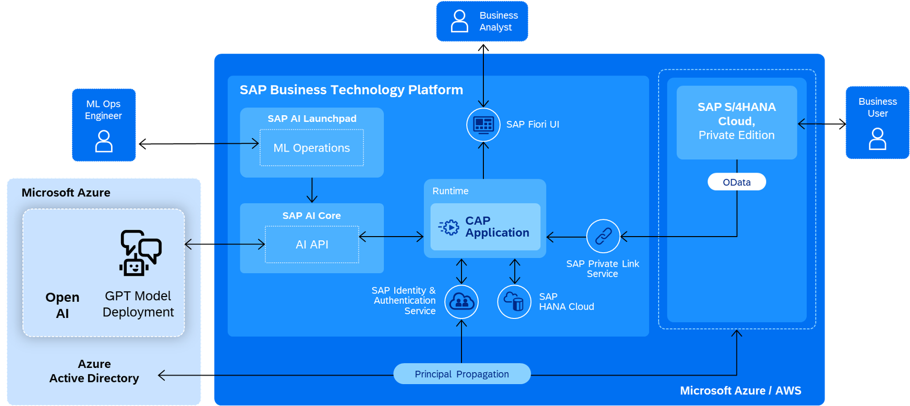

# ASUG Tech Connect 2023 Hands-on Lab "ChatGPT and SAP: Leveraging SAP BTP and Microsoft Azure AI"

Welcome to ASUG Tech Connect 2023 in New Orleans! We're very happy to see your interest in our hands-on session and your desire to learn more about how to connect Large Language Models (LLM) like OpenAI's GPT model to your SAP system.

## Exercise Purpose
This tutorial is the exercise desciption for the ASUG Tech Connect Hands-on Lab session "ChatGPT and SAP: Leveraging SAP BTP and Microsoft Azure AI" and is intended to be used in class with instructors on-site, in case of questions. Please follow all the steps and read the instructions carefully. In case of questions or when you get stuck, try to discuss and troubleshoot with your fellow learners and raise your hand in case you want support from one of the instructors.

## SAP Business Scenario
The business use case that this hands-on session is built on is part of the [Lead to Cash process](https://api.sap.com/valueflow/LC1C1-SVFSolutionProcess), which spans multiple business applications including order fullfillment. A key component of the process is material availability, that is, how much of a product is available and from where, being up to date and accessible in real-time. In these exercises, you will leverage SAP Business Application Studio (BAS), SAP Cloud Application Programming (CAP), and SAP Build Apps to consume the product availability service on SAP S/4HANA for unified visibility through an SAP BTP extension. You will be able to access the material availability data via an OData service and display it in a Fiori Elements UI (optional exercise) as part of the SAP BTP extension that you'll create.

## Adding Generative AI
With the efforts of building the Material Availability scenario that are described in detail in this [SAP Discovery Center mission](https://discovery-center.cloud.sap/missiondetail/4356), you can query the system by following the OData syntax and API documentation. As LLM are great in generating code, they also work well in creating OData queries according to relevant V2 or V4 syntax. Interactions with the LLM can be leveraged with prompts or embeddings, the latter being done with a vector database, such as the SAP HANA Cloud Vector Engine which also serves to keep your business data private. In this exercise, we will use prompt engineering and a Microsoft Azure OpenAI reference architecture to get the job done in a similar way to simply asking ChatGPT. You will first generate an OData query through natural language to help generate the SAP S/4HANA API call. We'll then take the result set from that generated OData query and run it against the SAP S/4HANA system using the created Material Availability CAP service created in the first exercise. Finally, we'll ask GPT to interpret the JSON result and summarize any anomolies or missing data in the last step.

## SAP Build Apps
For creating a simple user interface and the process logic for our Material Availability Chatbot, we'll be using SAP Build Apps, SAP's low-code/no-code tool that formerly was called SAP AppGyver. For this purpose, we'll be using the free SAP Build Apps Community Edition in addition to the SAP BTP trial account that you'll be using for creating the CAP service in BAS. This SAP Build app prompts the user to provide a question about material availability in natural language, engineers the prompt for the LLM, executes the resulting OData query, and summarizes the output through a call to the Generative AI Hub service, proxied by CAP.

## Exercise Steps
- PRE-WORK (ideally already done): [Create and setup your SAP BTP Trial account and adding Business Application Studio](https://developers.sap.com/tutorials/appstudio-onboarding.html)
- PREP (build your backend service): [Create Material Availability CAP service](https://github.com/SAP-samples/btp-extension-s4-material-availability/blob/main/tutorials/3-basic/1-create-service/README.md)
- EXERCISE 1 (import the pre-built project): [Import OData Query Builder](./exercises/GenAI/exercise1/README.md)
- EXERCISE 2: (summarize results and find issues, build a combined UX): [Lead to Cash Troubleshooter](./exercises/GenAI/exercise2/README.md)
- OPTIONAL: [Create a Material Dashboard UI Application for a classic view of the data](https://github.com/SAP-samples/btp-extension-s4-material-availability/blob/main/tutorials/3-basic/2-create-ui-application/README.md)

## License
Copyright (c) 2023 SAP SE or an SAP affiliate company. All rights reserved. This project is licensed under the Apache Software License, version 2.0 except as noted otherwise in the [LICENSE](LICENSE) file.
