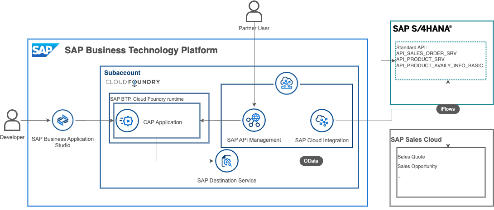

# Deliver Connected Experiences with a single view of Material Availability

## Description
The [Lead to Cash process](https://api.sap.com/valueflow/LC1C1-SVFSolutionProcess) spans multiple business applications, and connects both employees and partners from initial interactions to order fulfillment. A key component of the process is material availability, that is, how much of a product is available and from where, being up to date and accessible in real-time. This is equally important across direct sales and distribution channels, where internal sales reps and external distribution partners may be competing for the same inventory.

In this use case, you will see how SAP CX and SAP S/4HANA are integrated through SAP BTP, and how the process can be extended to provide an additional "Vendor Available to Promise (ATP)" capability. You will leverage SAP Business Application Studio and SAP Cloud Application Programming (CAP) model to consume the Product Availability service on SAP S/4HANA and ensure unified visibility across upstream and downstream channels.

## Challenge
For companies to more tightly integrate their supply chains, it is critical they rely on their existing digital core. A single source of material availability is required to serve internal and external stakeholders and deliver an optimal customer experience.

## Solution
Pre-built integrations and extension applications tightly coupled with your SAP business applications. A "one-click" deployment experience to quickly realize the outcome in your SAP BTP global account.

## Outcome
After running this use case, you will understand the best practices for realizing the Intelligent Enterprise process, Lead to Cash, and how it is implemented. You will also deploy an extension application on SAP BTP for providing access to material availability to partners, and experience developer efficiency enhancements made possible by [SAP Business Application Studio](https://www.sap.com/products/technology-platform/business-application-studio.html) and [SAP Business Accelerator Hub](https://api.sap.com/)

## Requirements
The required systems and components are:

- SAP S/4HANA Public Cloud or On-Premise (2020 FPS02 or higher, as available through CAL).
- SAP BTP account

Entitlements/Quota required in your SAP Business Technology Platform Account:

| Service                            | Plan        | Number of instances |
| ---------------------------------- | ----------- | ------------------- |
| Connectivity                       | lite        | 1                   |
| Destination                        | lite        | 1                   |
| Cloud Foundry runtime              | free        |                     |

Subscriptions required in your SAP Business Technology Platform Account:

| Subscription                      | Plan             |
| --------------------------------- | ---------------- |
| SAP Business Application Studio   | free             |
| SAP Integration Suite (Optional)  | free             |

## Download and Installation
Refer to the [use case tutorials](./tutorials/1-discover/README.md) to get started

## Known Issues
None.

## How to obtain support
[Create an issue](https://github.com/SAP-samples/btp-extension-s4-material-availability/issues) in this repository if you find a bug or have questions about the content.
 
For additional support, [ask a question in SAP Community](https://answers.sap.com/questions/ask.html).

## Contributing
If you wish to contribute code, offer fixes or improvements, please send a pull request. Due to legal reasons, contributors will be asked to accept a DCO when they create the first pull request to this project. This happens in an automated fashion during the submission process. SAP uses [the standard DCO text of the Linux Foundation](https://developercertificate.org/).

## License
Copyright (c) 2023 SAP SE or an SAP affiliate company. All rights reserved. This project is licensed under the Apache Software License, version 2.0 except as noted otherwise in the [LICENSE](LICENSE) file.
