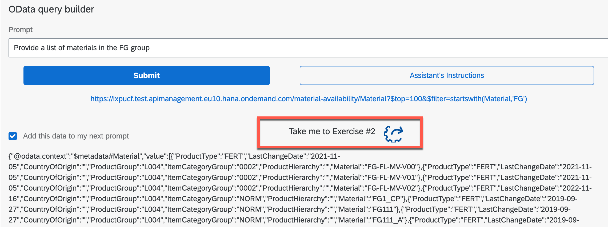
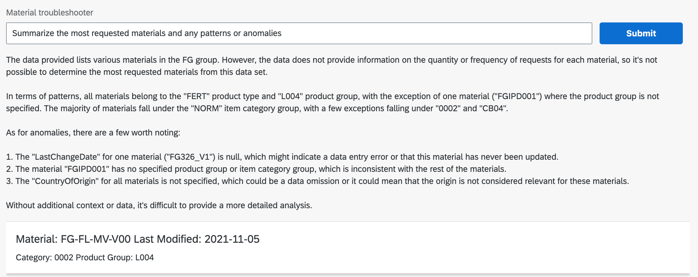
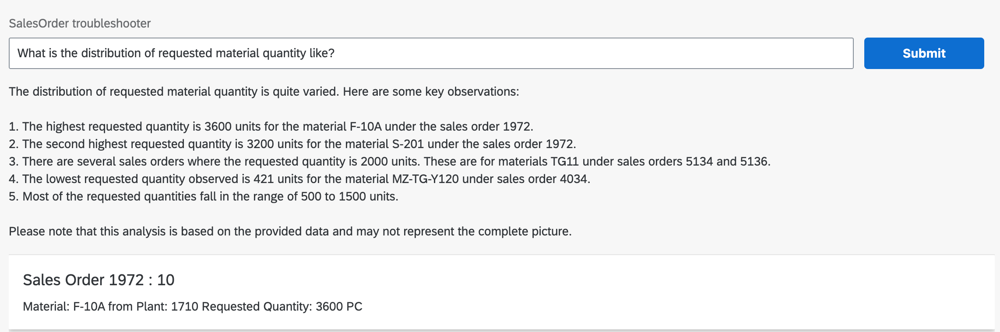
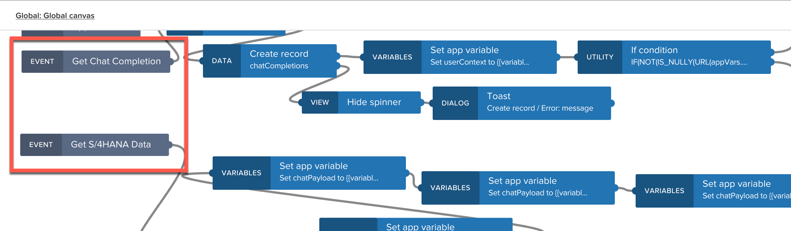
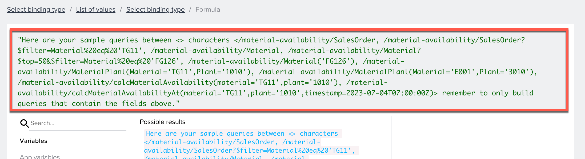
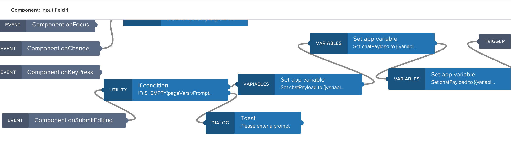
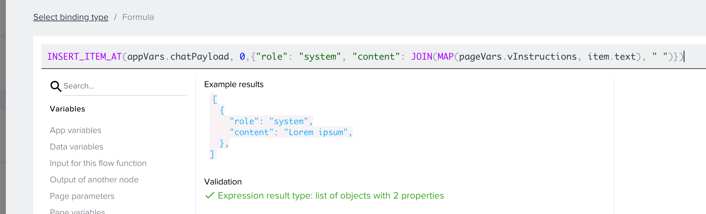
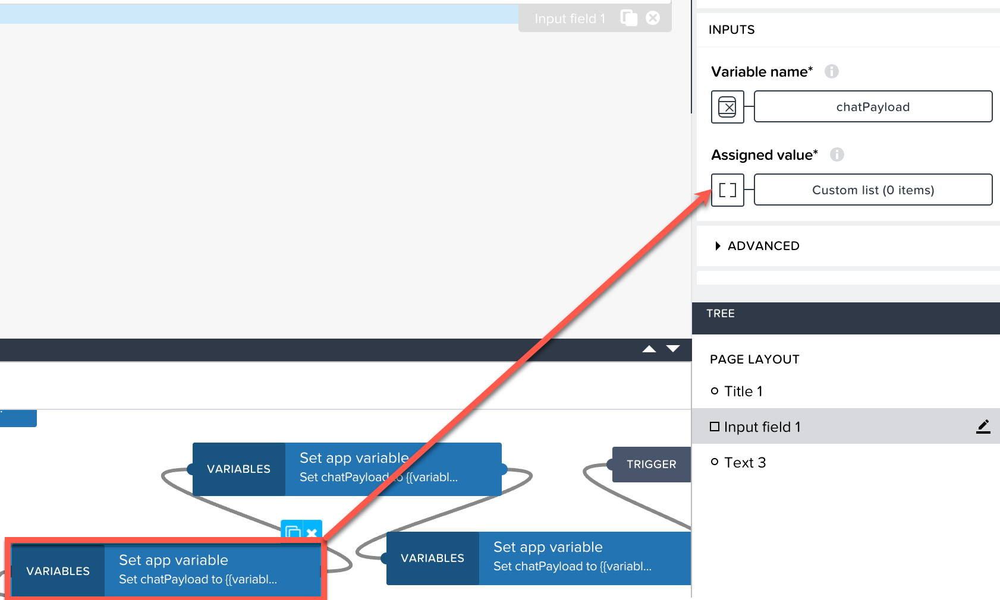
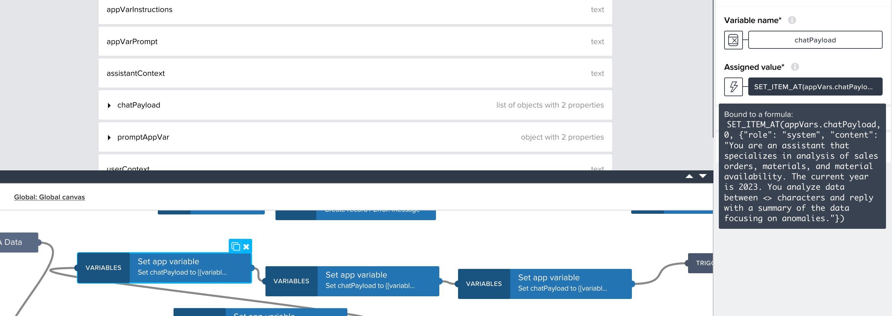

# Lead to Cash Troubleshooter

> [!IMPORTANT]
> Please note that the required backend systems, including SAP BTP Integration Suite and SAP S/4HANA have been retired after the event. That means, the given API key which is used in the provided project is no longer valid. Thus, this part of the overall hands-on experience cannot be executed outside of the event.

## Exercise 2 - Guided natural language queries
Now it's getting interesting ... We'll see how Generative AI can provide insight into business data and provide insights about business challenges. In this exercise, you will prompt the app with natural language questions about the data you have retrieved from SAP S/4HANA. Think about missing or incomplete data, anomalies in either the material or sales order data. You will experience the power of the LLM as it summarizes the data for business users in an easy to understand way and points out things to look out for.

> [!IMPORTANT]
> Please don't take single row query results into Exercise 2. If you don't get data, click the **Reset** icon and try a different initial query.

Once you have an OData query result from Exercise 1 that you're happy with, click the link to run the OData API call and get information out of the SAP S/4HANA backend system. The result is shown as a JSON to give you an idea of how machine readable data can be consumed by generative AI. Mark the check box **Add this data to my next prompt**  and click on the **Take me to Exercise #2** icon to continue with the data in the provided result.

This step takes you to a new screen where the JSON output from the API call is displayed and you can perform further queries for summarization or anomaly detection in natural language. If no data is diplayed, it means no data was returned. In that case, click on the **Reset** button in the upper left and try a new prompt. Depending on the query from Exercise 1, the app will either display **Material Troubleshoter** or **SalesOrder troubleshooter** in the header. Material availability queries that return a single row have been excluded from this example so stick with a Material or SalesOrder query.

Try the examples below with material and sales order data for further analysis:
- Material
  - Summarize the most requested materials and any patterns or anomalies
  - What are my 5 most popular materials?
  - What patterns do you find around missing or incomplete data?

  

- Sales Order
  - Summarize the list of sales orders and highlight any anomalies or missing data
  - List sales orders with requested quantity more than 100 units and order it from highest to lowest
  - What patterns do you find around missing or incomplete data?
  - What is the distribution of requested material quantity like?
  - Provide a hierarchical representation of Product Group, Product Type, and Material

  

Now it's time to try your own queries and find out more about the data in our SAP S/4HANA test system! With the **Reset** button on the upper left you can always go back and start a new initial query and pull material or sales order data from the SAP S/4HANA backend system.

## Optional "Do it yourself" supplement

In a true productive scenario, you would leverage embeddings and other techniques to deliver the analysis to a business user with a single natural language query. We can simulate this in SAP Build Apps by combining the logic from the first two pages so that callouts to LLMs and to SAP business applications are handled consecutively, with only the final response visible to the user.

If you find yourself at this point with time left in the session, "stretch your legs" by combining the logic from the first two pages into a third, to deliver a user experience closer to the ideal outcome. We do this by adapting the messages sent to GPT and utilizing **system**, **user**, and **assistant** roles. You can read the [reference documents](https://help.openai.com/en/articles/7042661-chatgpt-api-transition-guide) for details on how this works.

The key steps for this are as follows:

1. Implement calls to Chat Completions and SAP S/4HANA through the [Global Canvas](https://docs.appgyver.com/docs/trigger-event-logic) to promote reuse.

  

2. Amend the starting system instructions and temperature to ensure functional queries are returned. This can be done by adding something like, "You discard any extra language or properties that do not exist in the sample queries provided."

  

You can further refine the prompt to make it explicitly clear that the fields from these samples are the only viable ones to use, as above.

3. Utilize the **onSubmitEditing** event on the text input field to process the request when the **return/enter** button is tapped. This makes adding a submit button unecessary.

  

4. Use the **INSERT_ITEM_AT**, **WITH_ITEM**, and **SET_ITEM_AT** functions to add, update, or move values in the conversation chain.

  

5. Initialize a blank value for your chat history with every submission so that you can run additional prompts without refreshing your app.

  

6. Update the system instructions iteratively to first return an OData query and then to return a summary focusing on anomalies.

  

In case you are running out of time or just want to see the end result, a [final application](../../../Tech%20Connect%20Final.zip.gpg) archive has been shared so you can import and try it out.

Congratulations! You have completed all of the exercises for this session.
