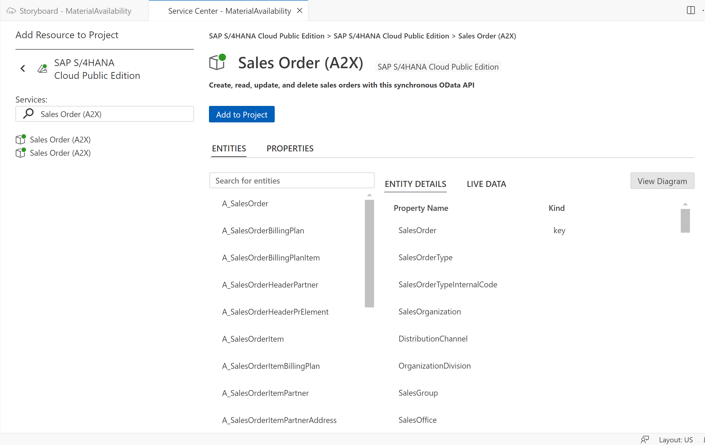
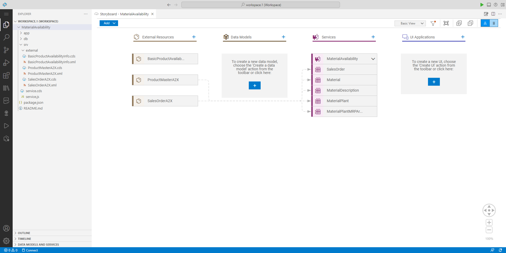
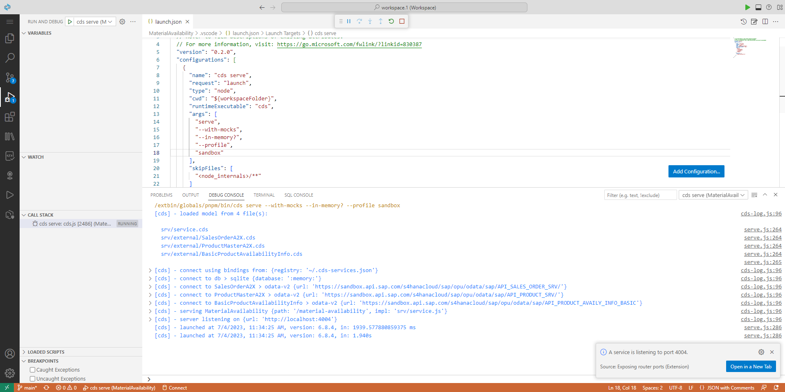

# Create Material Availability CAP Service
In this section, you will create a CAP project in SAP Business Application Studio, and implement a Material Availability service layer exposing and mashing up data from external SAP S/4HANA services.

## Create a CAP project
1. Access SAP Business Application Studio from the SAP BTP cockpit under **Subscriptions and Instances** and create a new **Full Stack Cloud Application** dev space (or run an existing dev space of this type).
2. Once dev space is running, access it by clicking on its name.
3. From the dev space **Get Started** page, select the **Start from template** option and start creating a new CAP Project.
4. Enter your CAP project name, for example: Material Availability, and keep the default Node.js runtime. Then click **Finish** to generate the project content in your workspace.

## Import external SAP S/4HANA Service Data Models
In this step, you will consume the following SAP S/4HANA services to retrieve and calculate relevant information for the Material Dashboard application:
- Sales Order Service: https://api.sap.com/api/API_SALES_ORDER_SRV
- Product Master Service: https://api.sap.com/api/API_PRODUCT_SRV
- Basic Product Availability Info Service: https://api.sap.com/api/API_PRODUCT_AVAILY_INFO_BASIC

Before you can start consuming these external services from the Material Availability CAP Service, you must import the external service data models to your CAP project. 
This can be done easily from SAP Business Application Studio using the [Service Center](https://help.sap.com/docs/bas/sap-business-application-studio/explore-services-using-service-center):
1. Open the Service Center and expand the **SAP BUSINESS ACCELERATOR HUB** section.
2. Expand the **SAP S/4HANA Cloud** product and hover over the SAP S/4HANA Cloud package under it.
3. Click on the search icon for the **SAP S/4HANA Cloud** package, and search for **Sales Orders (A2X)** service.
4. Login with your SAP Business Accelerator Hub credentials, once prompted.
5. An editor tab with the service information is opened. You can view the service properties, including the service entities and live data fetched from the SAP Business Accelerator Hub's sandbox environment.
6. From the service tab, click on **Service Actions** and select **Add External Data Model to CAP Project**. Select your CAP project from workspace, and click **Add** to complete the operation.   



7. Repeat steps 3-6 for services **Product Master (A2X)** and **Basic Product Availability Info**. 
8. Open the **Explorer** view to review the created resources in your project. For each service, a CDS model file is created under **srv/external** folder. In addition, the root **package.json** file is updated with required services information.

## Configure the service entrypoint from sandbox environment
In the **Basic Scope** of the mission, you will use a sandbox environment to consume external SAP S/4HANA services. This will be used for development and testing purposes only, and not for production. 

1. Open the **package.json** file from your project root folder.
2. For each required service (that you imported in the previous steps), modify the profile name from \[production\] to **\[sandbox\]**. 
3. Modify each required service **credentials** section to include only **url** property with the direct URL to the service from the sandbox environment. For production use, this would be implemented with **destination** and **path** properties instead. 
4. Verify your changes using the following reference code:
   - [Sales Order Service Sandbox Credentials](../../../package.json#L55-L58)
   - [Product Service Sandbox Credentials](../../../package.json#L70-L73)
   - [Availability Info Service Sandbox Credentials](../../../package.json#L85-L88)


## Implement the service
1. Open Terminal and run command `npm install @sap-cloud-sdk/http-client @sap-cloud-sdk/util` from your project root, to add dependencies required for consuming data from external services.
2. Trigger the [Command Palette](https://help.sap.com/docs/bas/sap-business-application-studio/command-palette) by pressing F1 key and select the **Open Storyboard** command. The Storyboard editor serves as an entry point for viewing and adding components to your CAP project.
3. From Storyboard, select the "+" button under the **Services** column to add a new service resource to your CAP project.
4. Open the created **srv/service.cds** file from your project, and copy the content from the service model [here](../../../srv/service.cds). This service definition imports the external service models added in the previous step. Then it defines the Material Availability service model as a mashup service from the 3 external SAP S/4HANA services. It exposes only the required entities as projections from the external service entities, including only the relevant properties. The MaterialPlant entity definition includes calculated availability fields that will be populated at runtime, in addition to the properties from the imported A_ProductPlant entity. In this way, the MaterialPlant entity will mashup data retreived at runtime from 2 different SAP S/4HANA services.
5. Copy [service.js](../../../srv/service.js) file including the service handlers implementation logic, into the **srv** folder in your project. The implementation in this file handles READ requests for all service entities defined in the model, also to support navigation between entities and other OData features such as the "expand" capability. The handlers for the MaterialPlant entity and for the Material entity (which may expand the MaterialPlant data using a navigation property) include special handling to fetch the required properties from the Product Master SAP S/4HANA service entities, and calculating availability properties by calling a function from the Basic Product Availability Info SAP S/4HANA service.
6. Go back to the Storyboard to view the created components in your project, and the connections between them. You can also open each service in the Graphical Modeler directly from the Storyboard (right click the service tile and select the option from the context menu) to view the complete service structure, including the entity properties and the navigation relationships between the service entities.



## Test the service from SAP Business Application Studio
1. Open Terminal and run command `npm i` from your project root to install dependencies.
2. Open the **.vscode/launch.json** file from your project, and add to the **args** list the `"--profile", "sandbox"` arguments, to run the service using the credentials from the sandbox profile you created.
3. Create a **.env** file in your project root and add it the following content:
   ```
   cds.requires.SalesOrderA2X.[sandbox].credentials.headers.APIKey=<Copied API Key>
   cds.requires.ProductMasterA2X.[sandbox].credentials.headers.APIKey=<Copied API Key>
   cds.requires.BasicProductAvailabilityInfo.[sandbox].credentials.headers.APIKey=<Copied API Key>
   ```
4. Access [SAP Business Accelerator Hub](https://api.sap.com/), login and open your user settings. Then from the API Settings press on the **Show API Key** button and then on **Copy Key and Close** option to copy your personal API key. This key serves as credentials for accessing the sanbox environment and must be provided as a header with each request sent to the sandbox services.
5. Back in SAP Business Application Studio, use the copied API key to replace the `<Copied API Key>` placeholders in the **.env** file content.
6. Open the **Run and Debug** view and start debugging using the launch configuration you created from the .vscode/launch.json file.
7. Once the service is running, press on the **Open in a New Tab** button from the notification. This will open a new browser tab for accessing the service process from the dev space localhost. You can also open this browser tab while the service is running from the Command Palette using the **Ports: Preview** command and selecting the 4004 port.



8. Test your service functionality by adding the path options below to the service URL in the opened browser tab. 
   \
   To debug the service runtime code, open the srv/service.js file and put a breakpoint in the relevant handler code lines.
   \
   Once completed your testing, press on the stop button from SAP Business Application Studio to terminate the debug session and the service process.

   **Simple READ OData queries:**
   - /material-availability/SalesOrder
   - /material-availability/SalesOrder?$filter=Material%20eq%20'TG11'
   - /material-availability/Material
   - /material-availability/Material?$top=50&$filter=Material%20eq%20'FG126'
   - /material-availability/Material('FG126')
   - /material-availability/MaterialPlant(Material='TG11',Plant='1010')
   - /material-availability/MaterialPlant(Material='E001',Plant='3010')
   
   </br>  
   Note the calculated availability properties added when reading the MaterialPlant entity.
   </br>
   In case the availability information cannot be found for the specific material and plant, a 0 quantity and an "N/A" base unit will be returned. The Debug Console in SAP Business Application Studio will indicate an error of calling the underlined Basic Product Availability Info S/4HANA service for calculating the availability information.

   </br>

   **OData queries including navigation or expantion of other entities:**
   - /material-availability/Material?$expand=to_Description
   - /material-availability/Material('TG11')?$expand=to_Description,to_Plant
   - /material-availability/Material('FG126')/to_Description
   - /material-availability/Material('FG126')/to_Description?$filter=Language%20eq%20'EN'
   - /material-availability/Material('TG11')/to_Plant
   - /material-availability/Material('D20_EPDM_SMRT_S')/to_Plant?$expand=to_PlantMRPArea
   - /material-availability/MaterialPlant(Material='D20_EPDM_SMRT_S',Plant='1010')/to_PlantMRPArea

   </br>
   
   **OData queries for availability functions:**
   - /material-availability/calcMaterialAvailability(material='TG11',plant='1010')
   - /material-availability/calcMaterialAvailabilityAt(material='TG11',plant='1010',timestamp=2023-07-04T07:00:00Z)

   </br>
   Make sure to change timestamp with today's date in order to get data, as the availability calculation cannot be performed for dates in the past.


