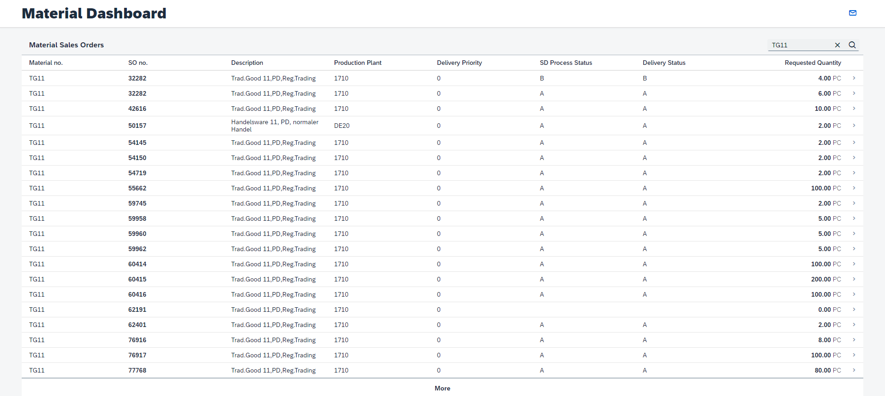
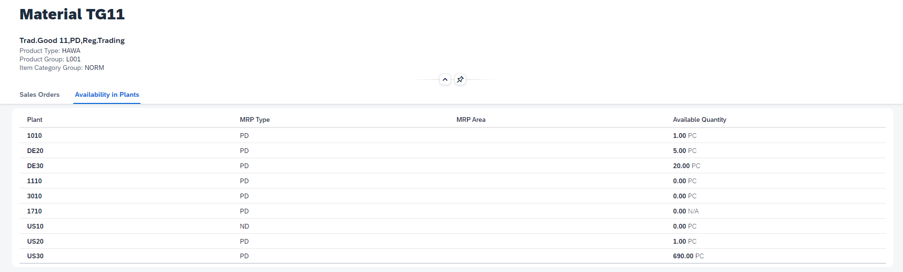

# Create Material Dashboard UI Application
In this section, you will use SAP Business Application Studio and SAP Fiori tools to implement a Material Dashboard UI Application in your CAP project, for consuming the Material Availability service data.

## Generate a Fiori UI Application from Template
1. From SAP Business Application Studio main menu, select the **File** -> **New Project from Template** option.
2. Select the **SAP Fiori Application** option and in the next step choose the **Basic** template, to create a Fiori freestyle application.
3. In the next step of **Data Source and Service Selection**, select the **Use a Local CAP project** as Data Source and choose your CAP project created from the previous section. Then select the **MaterialAvailability (Node.js)** option as the OData service to consume from the UI application and move to the next step.
4. In the **Entity Selection** step, enter **Worklist** as the view name.
5. In the final step of **Project Attributes**, type **materialdashboard** as the module name and type a description for your application, e.g. Material Dashboard UI. Keep the rest of the project attributes with their default values.
6. Click **Finish** to generate the application module under the **app** folder of your CAP project.

## Implement the Fiori UI Application
In this step you will enhance the generated application source code, to implement a Material Dashboard UI application consuming data from the Material Availability OData service.
The application is composed of two pages: a worklist page with material sales orders information, and an object page with details on the specific material ordered in some sales orders, including all the related sales orders of this material, and the availability information of the material from its production plants.

1. From the **Explorer**, expand the **app/materialdashboard/webapp** folder.
2. Copy all the view files from this reference [view](../../../app/materialdashboard/webapp/view/) folder into your application **view** folder (for existing files, overwrite their content). The view files include the definition of the UI controls and their data binding to the desired collections and properties from the OData service.
3. Copy all the view controller files from this reference [controller](../../../app/materialdashboard/webapp/controller/) folder into your application **controller** folder (for existing files, overwrite their content). The controller files include the view logic, including some manipulations on the UI controls data binding (such as filtering logic).  
4. In the **manifest.json** file, update the **routing** section with this reference [content](../../../app/materialdashboard/webapp/manifest.json#L90-L142) to support navigation between the application views.
5. Update the **Component.js** file content with this reference [code](../../../app/materialdashboard/webapp/Component.js) to add proper error handling to the application.
6. Copy [formatter.js](../../../app/materialdashboard/webapp/model/formatter.js) file into your application **model** folder to add data formatters used by the application views.
7. Update the **i18/i18n.properties** file content with this reference [content](../../../app/materialdashboard/webapp/i18n/i18n.properties) to add string resources for texts used in the application views.
8. Review the application source code copied from the reference content, in order to understand better the implementation details of the SAPUI5 application. 

## Test the Material Dashboard UI Application together with the Material Availability Service
1. Open the **Run and Debug** view and start debugging using the launch configuration you created from the .vscode/launch.json file of your CAP project (the same configuration created for testing the Availability Service implementation).
2. Once the application is running, press on the **Open in a New Tab** button from the notification. This will open a new browser tab for accessing the application process from the dev space localhost. You can also open this browser tab while the application is running from the Command Palette using the **Ports: Preview** command and selecting the 4004 port.
3. From the running application browser tab, click on the **/materialdashboard/webapp/index.html** link under the Web Applications section.
4. Test the functionality of the UI application you just created (with the data served from the Material Availability service, which is consuming data from the external SAP S/4HANA services according to the credentials provided with the relevant sandbox profile):
    - View the Material Sales Orders table (which is already filtering out completed orders and is ordered by priority).
    - Search for a Sales order number, Material identified, or description (or part of them) to filter the relevant sales orders. For example, search for: "Bike" or "TG11".
    - Navigate to Material object page by clicking on a row from the table (for example, navigate to material "TG11").
    - View the material details, including its description, product type, product group and item category group, provided from the Material OData collection and its related navigation properties.
    - View the material page section of Sales Orders, displaying all the associated sales orders for this material.
    - View the material page section of Availability in Plants, to view the material availability in the different company's plants. For each plant, see the plant details and the current available quantity of the material in it. If there is no availability information in SAP S/4HANA for a particular material the `0.00 N/A` value will be displayed.

This dashboard application’s purpose is to allow the end user to review the pending material sales orders, and therefore, to decide for each of them which material sales order can be delivered right away, according to the material availability information.

