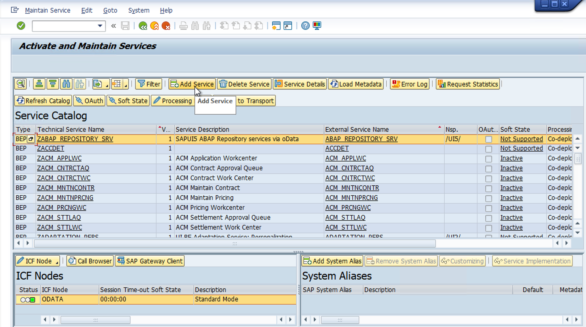
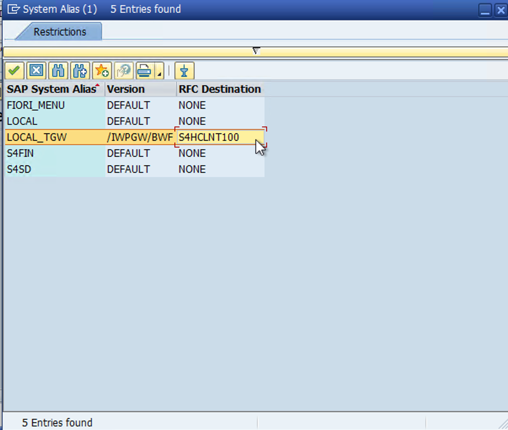
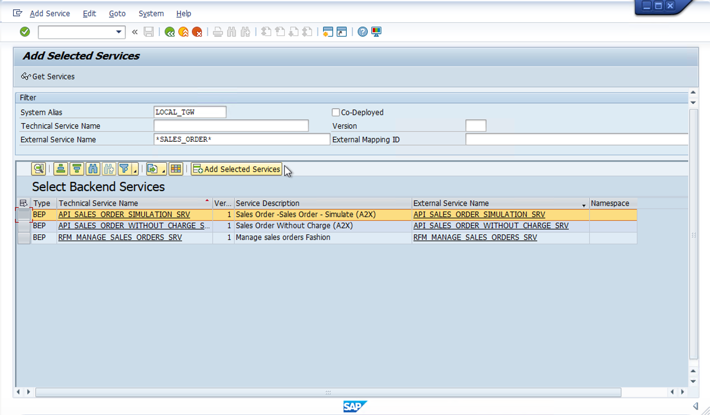
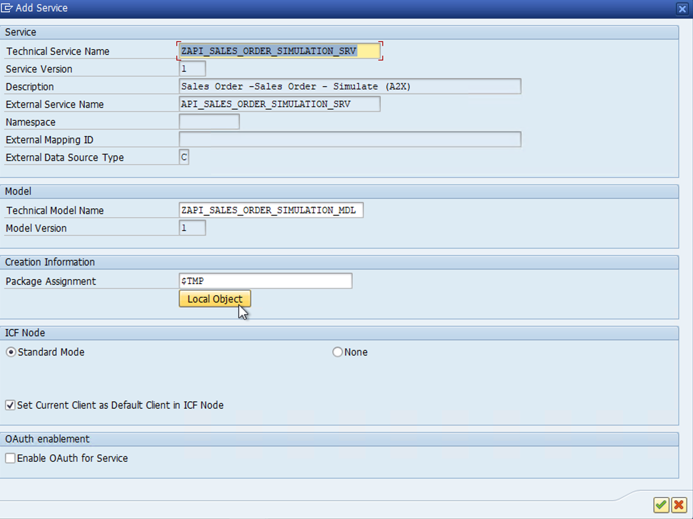
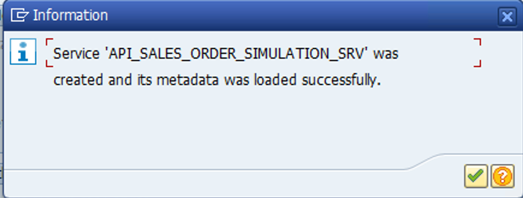
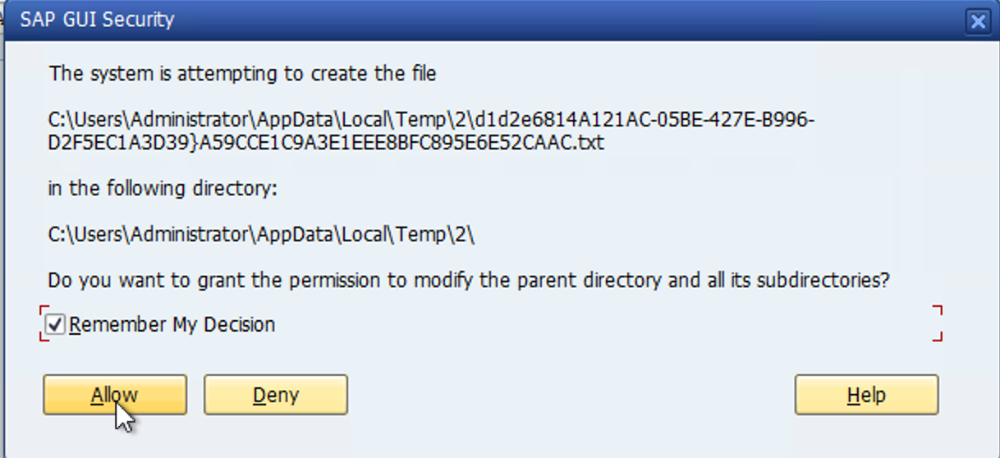
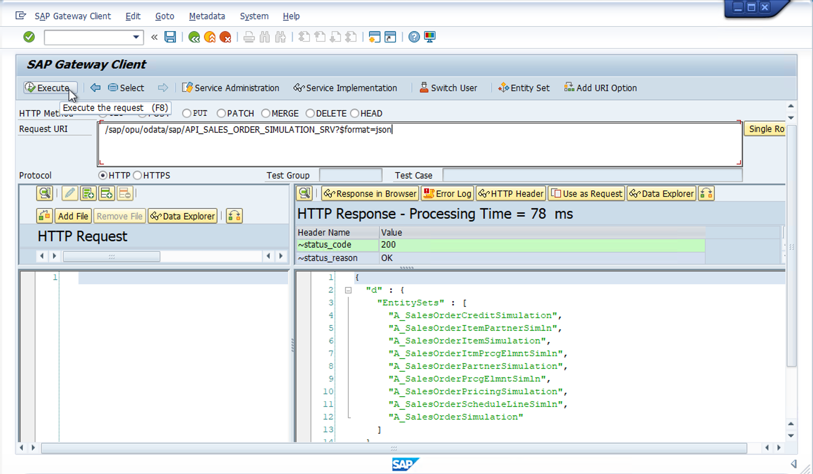

# Integrate with SAP S/4HANA

In the **Basic Scope**, you ran the Material Availability dashboard in SAP Business Application Studio, using a connection to the SAP Business Accelerator Hub SAP S/4HANA Cloud sandbox environment. Using SAP S/4HANA Cloud for live connectivity is then just the straightforward task of updating your destination properties. If you are using an SAP S/4HANA Fully Activated Appliance from the SAP Cloud Appliance Library, or your own on-premise instance, there are additional steps required to establish live connectivity. 

## Activate required services

The OData services used in the Material Availability dashboard are also available for SAP S/4HANA on-premise and private cloud editions. 

- Sales Order Service: https://api.sap.com/api/OP_API_SALES_ORDER_SRV_0001
- Product Master Service: https://api.sap.com/api/OP_API_PRODUCT_SRV_0001
- Basic Product Availability Info Service: https://api.sap.com/api/OP_API_PRODUCT_AVAILY_INFO_BASIC_0001

There is also a Sales Order simulation API that you can leverage in case you don't have access to an SAP Cloud for Customer or SAP Sales Cloud tenant.

- Sales Order - Simulate: https://api.sap.com/api/OP_API_SALES_ORDER_SIMULATION_SRV_0001

You can activate the needed services in your SAP S/4HANA system by performing the following steps:

1. Logon via SAP GUI.
2. Execute the ```/IWFND/MAINT_SERVICE``` transaction.
3. Select **Add Service**.



4. If you don't know the system alias, you can use the search button. Select or input the active SAP System Alias, which is called **LOCAL_TGW** in the fully activated appliance.



5. Locate the services based on a wildcard search in the **External Service Name** field, select the row, and click **Add Selected Services**. Remember to add all 4 external services, as listed in the [Activate Required Services](./README.md#activate-required-services) summary.



6. Set the package assignment to **Local Object** and click the green checkmark.



7. Confirm the service is activated successfully.



8. Test the newly activated services via the **/IWFND/GW_CLIENT** transaction. Allow any SAP GUI Security prompt that opens.



9. Enter the path from any of the services you just activated into the **Request URI** field and select **Execute**:

```/sap/opu/odata/sap/API_SALES_ORDER_SIMULATION_SRV?$format=json```



## Configure Cloud Connector

[Configure Systems in Cloud Connector](https://developers.sap.com/tutorials/btp-app-ext-service-cloud-connector.html)

## Set Up Principle Propagation (Optional)

By default, your SAP BTP destination will be created using Basic Authentication and a dedicated Technical User (e.g. BPINST if you are using the SAP S/4HANA Fully Activated Appliance). However, for productive use of an extension, it is important that a user's credentials in BTP are correctly passed down to the backend applications that it relies on. To configure principle propagation, follow this blog post on the topic:

[Setting up Principal Propagation](https://blogs.sap.com/2021/09/06/setting-up-principal-propagation/)

## Refer to SAP Best Practices for creation of sample data

In the SAP S/4HANA Fully Activated Appliance (client 100) you will find business processes that have already been set up for you to use, along with the corresponding sample data related to products and sales orders. Your company's own development and production environments of SAP S/4HANA would also have these business processes configured and ready for use.

If you need to create additional stock or sales orders you can follow the **Test scripts** for scope item 6LJ, or its dependent scope items called out in the **Business Conditions** section of the test script, on your CAL system from the SAP GUI:

[Available-to-Promise Processing (6LJ)](https://me.sap.com/processnavigator/SolP/6LJ)

## Configure SAP Cloud for Customer and SAP Integration Suite, Cloud Integration

As there is no trial option for SAP Cloud for Customer, this use case mission will explain the integration points between SAP business applications, and show you how to interact with the relevant API that enable the underlying functionality. In this section, we will also refer you to the specific integration packages that enable this scenario in your productive landscape.

There are 2 primary integration packages for SAP Cloud for Customer and SAP S/4HANA:

[SAP Cloud for Customer Integration with SAP S/4HANA](https://api.sap.com/package/SAPHybrisCloudforCustomerIntegrationwithSAPS4HANA/overview)
[SAP Cloud for Customer Integration with SAP S/4HANA Cloud](https://api.sap.com/package/SAPHybrisCloudforCustomerIntegrationwithSAPS4HANACloud/overview)

Each package consists of multiple scenarios, from replication of master data, transactions, and real-time insights related to material availability and pricing.

## View the demo scenario

You can watch a demo of the **Sales Quote External Pricing with S/4HANA Sales Order Fulfillment** process and how the integration of systems is facilitated by SAP Integration Suite and pre-packaged integration content:

[Video Demo](https://sapvideoa35699dc5.hana.ondemand.com/?entry_id=1_y9e8buvc)

Similarly, if you configured the [Sales Order - Simulate (A2X)](https://api.sap.com/api/API_SALES_ORDER_SIMULATION_SRV) service in your SAP S/4HANA Fully Activated Appliance, you can test the technical integration used by SAP Sales Cloud to request pricing and product availability from SAP S/4HANA.
 
Invoking the service with the sample parameters mentioned in the main [help documentation](https://help.sap.com/docs/SAP_S4HANA_CLOUD/03c04db2a7434731b7fe21dca77440da/b64937ce2692427594ee794ad033b8b3.html?locale=en-US) returns pricing or availability information depending on the associations included in the request body:

Simulate pricing
```
POST /sap/opu/odata/sap/API_SALES_ORDER_SIMULATION_SRV/A_SalesOrderSimulation
Content-Type: application/json
Accept: application/json

{
    "SalesOrderType": "OR",
    "SalesOrganization": "1010",
    "DistributionChannel": "10",
    "OrganizationDivision": "00",
    "SoldToParty": "10100001",
    "PurchaseOrderByCustomer": "SalesOrder Simulation",
    "to_Pricing": {},
    "to_PricingElement": [],
    "to_Item": [
        {
            "SalesOrderItem": "10",
            "Material": "TG11",
            "RequestedQuantity": "1"
        }
    ]
}
```

Simulate availability
```
POST /sap/opu/odata/sap/API_SALES_ORDER_SIMULATION_SRV/A_SalesOrderSimulation
Content-Type: application/json
Accept: application/json

{
    "SalesOrderType": "OR",
    "SalesOrganization": "1010",
    "DistributionChannel": "10",
    "OrganizationDivision": "00",
    "SoldToParty": "10100001",
    "PurchaseOrderByCustomer": "SalesOrder Simulation",
     "to_Item": [
        {
            "SalesOrderItem": "10",
            "Material": "TG11",
            "RequestedQuantity": "1",
            "to_ScheduleLine": []
        }
    ]
}
```

Comprehensive examples are found in the [Examples for Sales Order - Simulate](https://help.sap.com/docs/SAP_S4HANA_CLOUD/03c04db2a7434731b7fe21dca77440da/356340f1cd584bb899a5260115d24f13.html?locale=en-US) section of the SAP S/4HANA documentation.
